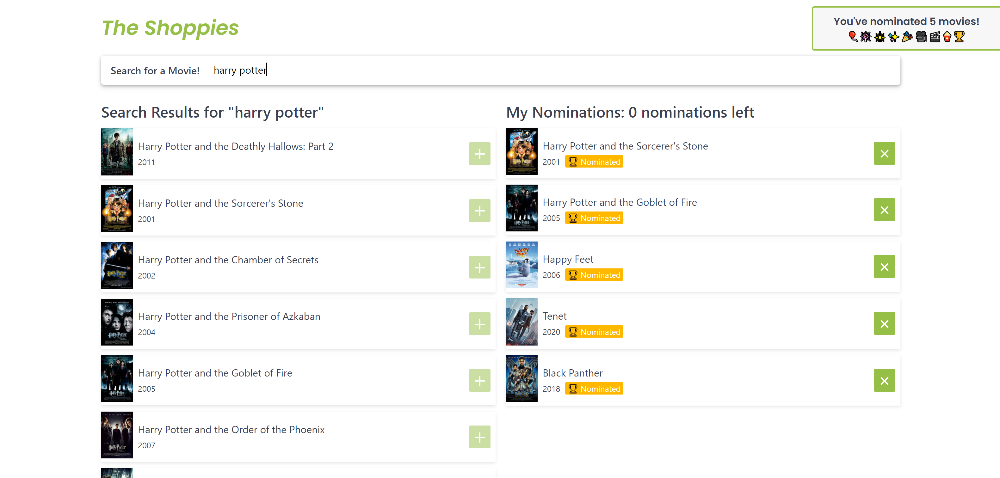

# The Shoppies: Shopify's Fall 2021 Frontend Developer Internship Challenge

The Shoppies is a webpage allowing users to search for their favourite movies and nominate upto 5 of them for a Shoppies. 

This app was built using React, and uses the OMDB API for movie data. Data fetching is done using Axios, global state is managed using Context API (And is PERSISTED using localStorage!), and animations are achieved usign Framer Motion. Spectre.css was used for some CSS-only components and styling utlities.



## Installation

Clone the repository and run the following command in your terminal in the repository's source folder.

```bash
yarn install
```

## Usage

Run the following command to run the app. The app will open on localhost:3000 (if not in use).

```bash
yarn start
```

